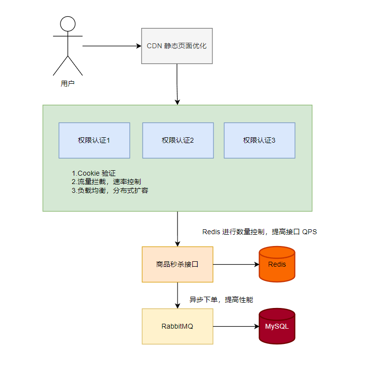
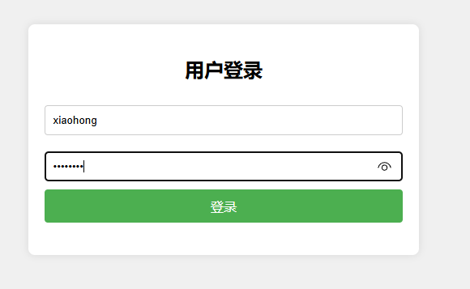
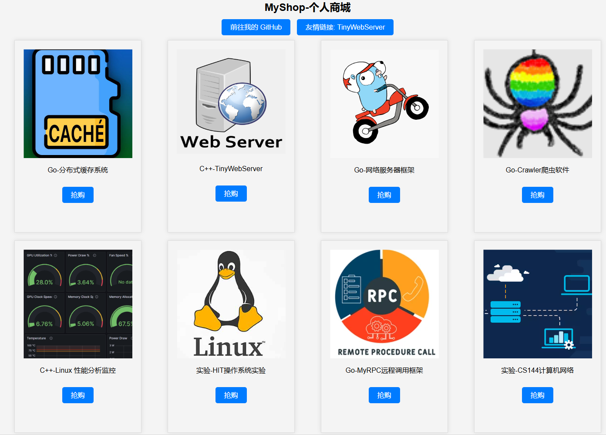
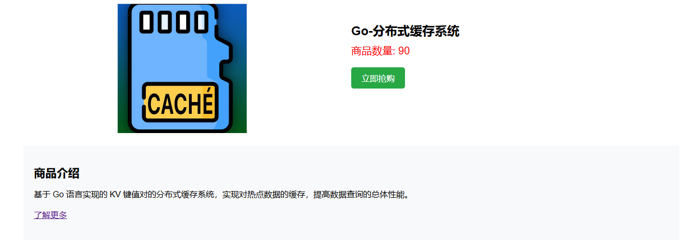

# ProductShop

## 项目架构




## 运行演示

| 服务器名称        | IP 内网             | 公网 IP |
| ----------------- | ------------------- | ------- |
| 前台代码服务器001 | 172.18.105.29:8080  |         |
| 后台代码服务器001 | 172.18.105.29:8081  |         |
| RabbitMQ          | 172.18.105.29:15672 |         |
| Validate          | 172.18.105.29:8083  |         |
| 数量控制          | 172.18.105.29:12345 |         |
| 压测服务器        |                     |         |


项目启动：

```shell
# 初始化 rabbitmq
$ docker run -di --name rabbitmq -p 4369:4369 -p 5671:5671 -p 5672:5672 -p 15671:15671 -p 15672:15672 -p 25672:25672 rabbitmq

# 初始化 redis
# 初始化 mysql

# 启动前端
$ go run fonted/web/main.go

# 启动后台
$ go run backend/web/main.go

# 启动验证
$ go run validate/validate.go

# 启动秒杀接口
$ go run getProduct/getProduct.go

# 启动 RabbitMQ 消费者
$ go run consumer/consumer.go
```


商城主页：


登录页面：



商城页面：



商品页面：



## 数据库

### MySQL

商品表：

```mysql
CREATE TABLE products (
  # 商品 ID
  ID INT PRIMARY KEY AUTO_INCREMENT,
  # 商品名称
  productName VARCHAR(255) NOT NULL,
  # 商品数量
  productNum INT NOT NULL,
  # 商品图片 URL
  productImage VARCHAR(255),
  # 商品链接
  productURL VARCHAR(255),
  # 商品的 github 链接
  productGHURL VARCHAR(255),
  # 商品简介
  productInfo VARCHAR(255)
);
```


用户表：

```mysql
CREATE TABLE users (
  # 用户 ID
  ID INT PRIMARY KEY AUTO_INCREMENT,
  # 用户昵称
  nickName VARCHAR(255) NOT NULL,
  # 用户名
  userName VARCHAR(255) NOT NULL,
  # 用户密码
  password VARCHAR(255) NOT NULL
);
```


订单表：

```mysql
CREATE TABLE orders (
  # 订单 ID
  ID INT PRIMARY KEY AUTO_INCREMENT,
  # 用户 ID
  userID VARCHAR(255) NOT NULL,
  # 商品 ID
  productID VARCHAR(255) NOT NULL,
  # 商品状态
  orderStatus INT
);
```


### Redis

Hash：

```c++
product-ID {
	# 商品总数
	total,
  # 已经被购买的数量
	ordered,
}
```


```redis
hmset product-1 total 100 ordered 0
hmset product-2 total 10 ordered 0
hmset product-3 total 100 ordered 0
hmset product-4 total 10 ordered 0
hmset product-5 total 90 ordered 0
hmset product-6 total 100 ordered 0
hmset product-7 total 100 ordered 0
hmset product-8 total 100 ordered 0
```


## 压力测试

处理器：12th Gen Intel(R) core(TM) i5-12500H

1. 测试权限验证 + 秒杀接口的 QPS：

   wrk：20 负载线程，200 个并发连接，30s 测试

   ```shell
   $ ./wrk -t20 -c200 -d 30s --latency -H "Cookie: uid=2;sign=EolgSkXWHdM3gIbvuwNh2w==" "http://172.18.105.29:8083/onsale?productID=1"
   Running 30s test @ http://172.18.105.29:8083/onsale?productID=1
     20 threads and 200 connections
     Thread Stats   Avg      Stdev     Max   +/- Stdev
       Latency     4.05ms    4.62ms  58.02ms   86.22%
       Req/Sec     3.48k   762.18    36.06k    81.50%
     Latency Distribution
        50%    3.23ms
        75%    5.97ms
        90%   10.01ms
        99%   20.15ms
     2079982 requests in 30.10s, 281.67MB read
   Requests/sec:  69112.84
   Transfer/sec:      9.36MB
   ```

2. 测试秒杀接口的 QPS：

   wrk：20 负载线程，200 个并发连接，30s 测试

   ```shell
   $ ./wrk -t20 -c200 -d 30s --latency -H "Cookie: uid=2;sign=EolgSkXWHdM3gIbvuwNh2w==" "http://172.18.105.29:12345/getProduct?productName=product-1&productNum=1"
   Running 30s test @ http://172.18.105.29:12345/getProduct?productName=product-1&productNum=1
     20 threads and 200 connections
     Thread Stats   Avg      Stdev     Max   +/- Stdev
       Latency    17.51ms   22.34ms 308.02ms   89.12%
       Req/Sec   836.86    514.36     1.93k    47.73%
     Latency Distribution
        50%    9.75ms
        75%   21.06ms
        90%   41.99ms
        99%  105.49ms
     498775 requests in 30.10s, 57.56MB read
   Requests/sec:  16573.09
   Transfer/sec:      1.91MB
   ```

